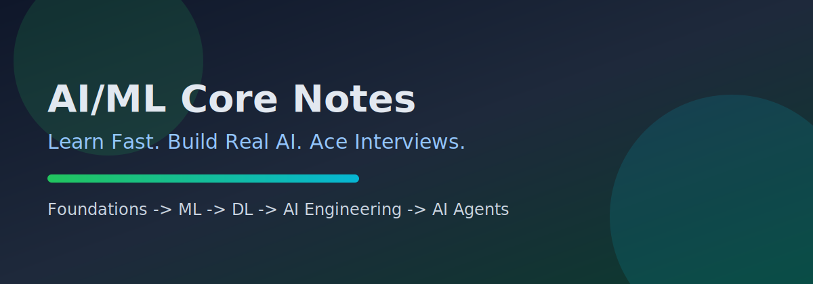

# AI/ML Core Notes 🧠⚡

Learn AI fast, build real AI systems, and prepare for interviews with practical depth.

## New Here? 15-Minute Quick Start ⏱️

If you only have 15 minutes, do this:

1. Open `docs/plan/project-plan.md` and scan goals + roadmap.
2. Read `docs/foundations/index.md` for core concepts.
3. Open `docs/interview-prep/question-bank.md` and answer 3 questions.
4. Run one quiz in `docs/practice/quiz-web.md`.

By the end, you will have a concrete learning path and a baseline score.

## Start Here 🚀

1. Foundations: `docs/foundations/index.md`
2. Machine Learning: `docs/machine-learning/index.md`
3. Deep Learning: `docs/deep-learning/index.md`
4. AI Engineering: `docs/ai-engineering/index.md`
5. AI Agents: `docs/ai-agents/index.md`
6. Interview Prep: `docs/interview-prep/index.md`
7. Practice Labs: `docs/practice/index.md`

## Choose by Goal 🎯

- Fast refresher: `docs/summaries/index.md`
- Deep technical understanding: `docs/deep-dives/index.md`
- Interview readiness: `docs/interview-prep/question-bank.md`
- Hands-on practice: `docs/practice/quiz-web.md`
- FAQ and blockers: `docs/faq.md`
- Project roadmap and execution: `docs/plan/project-plan.md`

## What You Get 📚

- Structured learning path from foundations to agents
- Interview tracks (junior, mid, senior)
- Practical labs and multilingual starter examples
- Quiz simulator with scoring modes and review flow
- Curated references (Kaggle, docs, datasets, packages)

## Support This Project 💛

If this content helps your AI journey, you can support maintenance and new educational material:

- Stripe: [Support AI/ML Core Notes](https://buy.stripe.com/8x200i8bSgVe3Vl3g8bfO00)
- GitHub Sponsors: `https://github.com/sponsors/dmoliveira`
- Buy Me a Coffee: `https://buymeacoffee.com/dmoliveira`

## Contribution Model 🤝

- Start from `docs/plan/project-plan.md`
- Pick one focused task and open a small PR
- Keep explanations didactic, practical, and learner-first

## License

This project is licensed under the MIT License. See [LICENSE](LICENSE).
